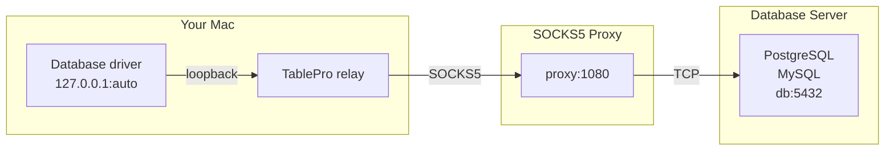

Leave the database's **Host** and **Port** on the General pane exactly as they are. The proxy resolves that name and dials it from its own side. A hostname that exists only inside the private network works, and no DNS query for the database leaves your Mac.

<Frame caption="The SOCKS Proxy pane in the connection form">
  
  
</Frame>

## How it works

No helper binary is involved: the relay is part of the app. It listens on a free loopback port and carries each connection through the proxy. If the relay dies mid-session, the connection reconnects and rebuilds it, up to ten attempts with a widening delay.

## Setting up

<Steps>
  <Step title="Enable the pane">
    Select **SOCKS Proxy** and turn **Enable SOCKS Proxy** on. Only one method at a time: anything else already enabled has a button here to switch it off.
  </Step>
  <Step title="Enter the proxy address">
    **Host** and **Port** under **Proxy Server**, plus **Username** and **Password** if the proxy authenticates.
  </Step>
  <Step title="Test it">
    On **General**, click **Test Connection**.
  </Step>
</Steps>

The pane appears for the drivers that support SSH tunneling; the [transport matrix](/connections/connection-form#which-drivers-get-which-panes) says which.

## Options

| Field | What it is | Default |
|-------|-----------|---------|
| **Host** | The SOCKS5 proxy's address. | - |
| **Port** | The proxy's port. | 1080 |
| **Username** | Only for a proxy that requires username and password authentication. | - |
| **Password** | Stored in the macOS Keychain. Blank connects without authentication. | - |

<Tip>
An SSH dynamic port forward is a SOCKS5 proxy. Run `ssh -D 1080 user@bastion`, then set the host to `127.0.0.1` and the port to `1080`.
</Tip>

[SSL/TLS](/connections/ssl) still applies, with one unavoidable adjustment: the driver dials a loopback port that no server certificate names, so **Verify CA** and **Verify Identity** fall back to **Required** and certificate paths are dropped.

## Troubleshooting

### Timed out connecting through the SOCKS proxy

Fifteen seconds passed with no path to the database. The proxy did not answer, rejected the credentials, or could not reach the database. Check the proxy host and port, then that the database answers from the proxy's network.

### Local network permission prompt

On macOS 15 and later, a proxy on your local network (a `192.168.x.x` address) raises the one-time Local Network alert. Allow it, or the proxy stays unreachable. A loopback proxy such as `ssh -D` on `127.0.0.1` never triggers it.

### The database rejects the connection

The path works and the server refused you. The driver's own error is shown, exactly as on a direct connection: check credentials, SSL settings, and whether the database accepts connections from the proxy's address.
