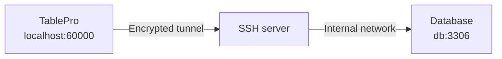

The database **Host** on the General pane is resolved from the SSH server, not from your Mac. A database on the SSH server itself is therefore `localhost`, not the server's public name, and a database elsewhere on the private network is whatever the SSH server calls it (an RDS endpoint, for instance).

## Set up a tunnel

<Steps>
  <Step title="Turn the tunnel on">
    In the connection form, open the **SSH Tunnel** pane and switch on **Enable SSH Tunnel**. A connection uses one transport at a time; if a Cloudflare tunnel, Cloud SQL Auth Proxy, or SOCKS proxy is already on, the pane offers a button to switch it off.
  </Step>
  <Step title="Name the SSH server">
    Fill in **SSH Host**, **SSH Port** (22 by default), and **SSH User**. With `~/.ssh/config` entries present, a **Config Host** picker appears above the host field instead.
  </Step>
  <Step title="Pick an authentication method">
    Password, Private Key, SSH Agent, Keyboard Interactive, or None. [Authentication methods](#authentication-methods) has the fields for each.
  </Step>
  <Step title="Set the database Host from the server's point of view">
    Back on **General**, `localhost` reaches a database on the SSH server itself. One on a unix socket needs [Socket Path](#forwarding-to-a-unix-socket) instead.
  </Step>
  <Step title="Click Test Connection">
    A wrong host, a blocked forward, or an agent nothing answered on names the real reason instead of timing out. [Troubleshooting](#troubleshooting) has the messages the SSH side reports.
  </Step>
</Steps>

To share one SSH config across connections, save it with **Save Current as Profile…** or pick an existing one from the **Profile** picker; see [SSH Profiles](/connections/ssh-profiles). To fill the whole pane from a string instead, paste a `scheme+ssh://` URL into the [Import from URL…](/connections/urls#ssh-tunnel-format) sheet.

<Frame caption="Reusing a saved SSH profile">
  
  
</Frame>

There is no **SSH Tunnel** pane on SQLite, PGlite, libSQL, Beancount, BigQuery, Cloudflare D1, DynamoDB, Elasticsearch, or Snowflake: each is reached over a local file, a loopback socket, or a vendor HTTP API.

## Authentication methods

| Method | What to fill in |
|---|---|
| **Password** | The SSH password. Prefer a key on anything production |
| **Private Key** | **Key File**, with **Browse** to pick one, and **Passphrase** if the key is encrypted. Leaving **Key File** empty auto-detects from `~/.ssh/config` and the default key locations |
| **SSH Agent** | **Agent Socket**: **SSH_AUTH_SOCK** for the `ssh-agent` macOS runs, **1Password** for its socket at `~/Library/Group Containers/2BUA8C4S2C.com.1password/t/agent.sock`, or **Custom Path** for Secretive or your own. Signing stays in the agent; the key is never read, and no key file is tried if the agent refuses |
| **Keyboard Interactive** | The SSH password, sent through SSH's challenge-response. Use it when the server rejects plain password auth, common with PAM |
| **None** | Nothing, for a server that authenticates the connection itself such as a [Tailscale SSH](https://tailscale.com/kb/1193/tailscale-ssh) host. A server that does want credentials fails the connect with a message naming the other methods |

**Private Key** is the one to pick unless the server only ever issued you a password.

### Verification codes and two-factor authentication

A keyboard-interactive challenge partway through authentication, from `google-authenticator` or `duo_unix` for example, is shown as the server worded it and your answer sent back. Every method except **None** supports this, a key or agent followed by a second factor included (`AuthenticationMethods publickey,keyboard-interactive`).

The **Two-Factor Authentication** section can answer TOTP codes instead. **None** and **Prompt at Connect** both ask when the server does; **Auto Generate** computes the code from the base32 **TOTP Secret** off your authenticator enrollment, with **Algorithm** (SHA1, SHA256, SHA512), **Digits** (6 or 8), and **Period** (30s or 60s) already set to what most servers use.

## Host keys

A first connection shows the server's key type and SHA-256 fingerprint, in `ssh-keygen -l` format, and waits for **Trust**. Trusted keys go to `~/Library/Application Support/TablePro/known_hosts`.

If a trusted server's key later changes, an **SSH Host Key Changed** alert lists the previous and current fingerprints. **Connect Anyway** does not answer the Return key. Escape picks **Disconnect**, which is what to take unless you know the server was reinstalled. With jump hosts, every hop's key is verified the same way.

## Using ~/.ssh/config

Pick an alias from the **Config Host** picker and `HostName`, `User`, `Port`, `IdentityFile`, `IdentityAgent`, and `ProxyJump` are resolved from the config at connect time. Anything typed into the form overrides the file, which is re-read whenever it or an `Include`d file changes.

<Frame caption="Picking a host from ~/.ssh/config">
  
  
</Frame>

## Jump hosts

For a database behind more than one bastion, expand **Jump Hosts** and add each hop in order. Each hop is an SSH session tunneled through the previous one, with no `ssh` subprocess involved.

| Field | Description |
|-------|-------------|
| **Host** | Hostname or IP of the jump host |
| **Port** | SSH port, 22 by default |
| **Username** | SSH username for this hop |
| **Auth** | **Private Key** or **SSH Agent**. Password auth is not offered for a hop |
| **Key File** | Private key path, under Private Key auth |

With the list left empty and an SSH host that matches a config entry carrying `ProxyJump`, that directive is followed instead.

## Forwarding to a unix socket

Some servers listen on a unix socket with no TCP port open at all, a PostgreSQL box set up for `local` connections in `pg_hba.conf` being the usual case. Fill in **Socket Path** on the General pane and the forward targets that socket, the same thing `ssh -L 5434:/var/run/postgresql/.s.PGSQL.5432 server` does by hand. **Host** and **Port** are ignored while a socket path is set. Jump hosts still apply: the hops reach the SSH server, and the socket opens from there.

Point at the socket file, not the directory holding it:

| Database | Typical socket path |
|----------|---------------------|
| PostgreSQL | `/var/run/postgresql/.s.PGSQL.5432` |
| MySQL / MariaDB | `/var/run/mysqld/mysqld.sock` |
| Redis | `/var/run/redis/redis.sock` |

`peer` authentication works: the SSH server opens the socket as your SSH login user, so a `local all all peer` line authenticates you as the PostgreSQL role of that name.

A database on a socket cannot negotiate TLS, so SSL is switched off for the connection. The SSH tunnel still encrypts the whole path.

## If the tunnel drops

A keep-alive goes out every 30 seconds. When one fails the session drops to connecting and the tunnel is rebuilt, retrying at 2s, 4s, 8s and doubling to a 120-second ceiling, ten attempts at most. A query in flight dies with the tunnel and is not replayed. After ten failures the session ends with **SSH tunnel disconnected. Click to reconnect.**

If tunnels keep dropping on an idle network, the keep-alive is not the missing piece: check the server's `ClientAliveInterval` and the idle timeouts on any firewall or load balancer in between.

## Troubleshooting

### "The SSH server could not reach …"

SSH is fine and the forward is not. Almost always the **Host** field: that address is resolved from the SSH server, so a database bound to `127.0.0.1` (the MySQL and PostgreSQL default) needs **Host** set to `localhost`. Check what it is bound to with `ss -lntp` on the server. If the host is right, check `sshd_config` for `AllowTcpForwarding yes`.

### "The SSH server did not open a forwarding channel to …"

The destination took the connection and never answered, which usually means a firewall or security group dropping packets rather than refusing them. Test it from the SSH server: `ssh user@server "nc -zv db-host 3306"`.

### "The SSH server would not forward the socket …"

The socket path does not exist on the server, or `sshd_config` sets `AllowStreamLocalForwarding no`. That is a separate setting from `AllowTcpForwarding`.

### "No SSH agent answered on the socket from …"

Nothing is listening where that socket points, and the message names which of the three set it: **Agent Socket** on the SSH Tunnel pane, an `IdentityAgent` line for the host in `~/.ssh/config`, or `SSH_AUTH_SOCK`. Change it in the place the message names.

`SSH_AUTH_SOCK` is the one that catches people out. An app launched from Finder gets it from launchd, which means the `ssh-agent` macOS runs, whatever a shell profile exports. 1Password and Secretive are reached by naming their own socket: switch **Agent Socket** to **1Password**, or to **Custom Path**.

A jump host has no **Agent Socket** field of its own, so its agent comes from `IdentityAgent` or `SSH_AUTH_SOCK`.

### "The SSH agent from … holds no keys."

The agent answered and offered nothing. 1Password serves keys only while it is running and unlocked, and Secretive only while its agent is loaded; unlock it and add the key there. `ssh-add` loads keys into the `SSH_AUTH_SOCK` agent alone, so it is the fix only when that is the socket in the message.

### "SSH agent did not authenticate. …"

The agent offered keys and the server accepted none of them. Check the public key is in `~/.ssh/authorized_keys` on the server for the **SSH User** you filled in, and that the key you expect is in the agent rather than only on disk.

### The tunnel connects and the database refuses the login

The database credentials are separate from the SSH ones. Check you did not carry one set into the other.

### A firewall prompt on connect

The local end of the tunnel listens on a port between 60000 and 65000. Allow it.

### SSH fails instantly against a server on your own network

macOS 15 and later put outbound connections to local network addresses behind a Local Network permission, and a denied app fails fast with "no route to host". Check TablePro under **System Settings > Privacy & Security > Local Network**. Servers over the internet, and anything on `127.0.0.1`, are unaffected.

### SSH itself fails

Try the same host, user, and key in Terminal with `ssh -v user@server`. If that fails too, the problem is server-side.
