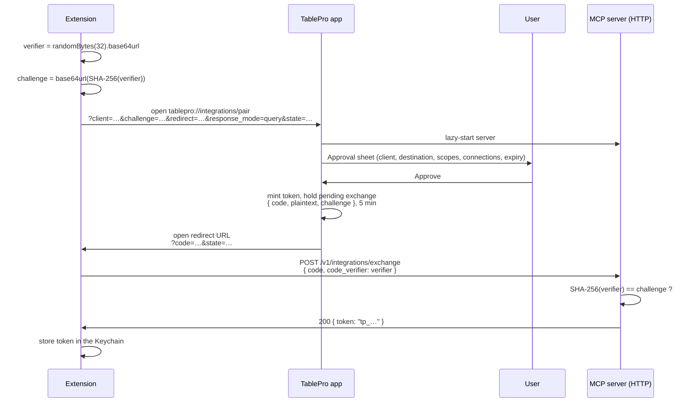

Four steps: generate a verifier, open a deep link, catch the one-time code, trade it for a token over
localhost. TablePro releases the token only to the caller that can produce the verifier, so an app
that intercepts the redirect holds a code it cannot spend.

Nothing about this is Raycast-specific. Any client that can receive a callback, through its own URL
scheme or a loopback HTTP listener, can pair.

## Sequence



The name in the heading is whatever `client` asked to be called, so read the line under it: it names
the address the code is delivered to. Approve only when that address belongs to the app you started
the pairing from.

<Frame caption="Scope, connections and expiry are all editable before Approve">
  
  
</Frame>

## The whole client, in one file

```ts
import { randomBytes, createHash } from "node:crypto";

const b64url = (b: Buffer) =>
  b.toString("base64").replace(/\+/g, "-").replace(/\//g, "_").replace(/=+$/, "");

// Step 1. Keep the verifier and the state in memory until the exchange. Never log the verifier.
const verifier = b64url(randomBytes(32));
const challenge = b64url(createHash("sha256").update(verifier).digest());
const state = b64url(randomBytes(16));

// Step 2. Open the deep link. The parameters are on the URL scheme page.
const params = new URLSearchParams({
  client: "My Editor on macbook-pro",
  challenge,
  redirect: "http://127.0.0.1:7391/callback",
  response_mode: "query",
  state,
  scopes: "readWrite",
});
await openUrl(`tablepro://integrations/pair?${params}`); // however your host opens a URL

// Step 3. Your callback receives ?code=<uuid>&state=<state>, or ?error=access_denied when the user says no.
// 23508 is the default port. Make it a setting: if the port is taken, the server binds another one,
// and the Status row in Settings > MCP shows the port in use.
export async function exchange(callback: URL, port = 23508): Promise<string> {
  const query = callback.searchParams;
  if (query.get("state") !== state) throw new Error("pairing state mismatch");
  const code = query.get("code");
  if (!code) throw new Error(`pairing refused: ${query.get("error")}`);

  const res = await fetch(`http://127.0.0.1:${port}/v1/integrations/exchange`, {
    method: "POST",
    headers: { "Content-Type": "application/json" },
    body: JSON.stringify({ code, code_verifier: verifier }),
  });
  if (!res.ok) throw new Error(`pairing failed: ${res.status}`);

  const { token } = await res.json();
  return token; // Step 4. Straight into the Keychain, never a plain file.
}
```

Three constraints decide whether TablePro accepts the request at all:

- The **verifier** is 43 to 128 characters from `A-Z a-z 0-9 - . _ ~`. 32 random bytes in base64url
  is 43.
- The **challenge** is its base64url SHA-256, so exactly 43 base64url characters.
- The **redirect** is a loopback `http` or `https` URL (`127.0.0.1`, `localhost`, `::1`), or a
  private-use scheme an installed app has registered. Anything else is refused with *"The redirect
  address is not a local callback, so pairing was refused."* That covers a redirect carrying
  credentials, `tablepro://` and the database URL schemes TablePro opens, a scheme a web browser
  handles (such as `google-chrome:`), and network schemes whose handler fetches from the host they
  name, such as `smb://`, `ssh://` and `webcal://`.

The exchange endpoint takes no bearer token: the single-use code plus the verifier is the credential.
It and `/mcp` are the only paths the server serves, and both accept `POST` only.

## Response modes

`response_mode` decides how the answer reaches `redirect`. Send `query`. Use `context` when your host
passes an extension a single launch parameter named `context`, as Raycast does.

| `response_mode` | Approve | Deny |
|-----------------|---------|------|
| `query` | `?code=<uuid>&state=<state>` | `?error=access_denied&error_description=user_denied&state=<state>` |
| `context` | `?context={"code":"<uuid>","state":"<state>"}` | `?context={"error":"access_denied","error_description":"user_denied","state":"<state>"}` |
| absent (deprecated) | `?context={"code":"<uuid>"}` for `raycast://`, `?code=<uuid>` for any other scheme | `error=denied` and `error_description=user_denied`, wrapped the same way |

The `context` value is JSON with sorted keys, percent-encoded like any other query value. Any other
`response_mode` drops the link: no sheet opens and nothing reaches `redirect`. Query items already on
`redirect` stay as they were, with these appended after them.

### State

`state` is optional and opaque: up to 1,024 UTF-8 bytes, returned unchanged on approve and on deny,
in every mode. A longer one drops the link the same way. Send a fresh random value with each request
and drop any callback whose `state` does not match the request you started.

### Deprecated: no `response_mode`

A link without `response_mode` still gets the delivery in the last row of the table, and is
deprecated. A later release will read a missing `response_mode` as `query`, so send it explicitly.
[Versioning](/developers/versioning) has the policy.

## What the user approves

The sheet names the client and counts down the five minutes the request is good for, dimming
**Approve** when it runs out. Three controls sit under that: **Permission Level** (starting at what
the link asked for, movable in either direction), **Allowed Connections** (all, or a checked subset),
and **Expiration** (never, 1, 7, 30 or 90 days). The link's parameters are a request, not a grant.

Approving mints the token, holds the plaintext against a one-time code for 5 minutes, and opens the
redirect. Pairing again mints a second token rather than replacing the first, so an extension that
re-pairs should stop using its old one. Revoke either under
**Settings > MCP > Authentication**.

## Security properties

| Property | How |
|----------|-----|
| The token is never in a URL | It travels over localhost HTTP; the deep link carries only a code. |
| Intercepting the redirect is useless | The code cannot be exchanged without the verifier. |
| A code is single-use | Success, a failed verification, or 5 minutes deletes it. |
| The plaintext token is not persisted | Only a salted SHA-256 hash is saved, in the login keychain. |

## Errors

A failed verification burns the code, so retrying with a guessed verifier is not an option: start a
new pair request.

| Code | Meaning |
|------|---------|
| `400` | Malformed body, a missing `code` or `code_verifier`, a field over 1,024 bytes, or a verifier that is not 43 to 128 unreserved characters. |
| `403 Challenge mismatch` | The verifier does not hash to the stored challenge. |
| `404 Pairing code not found` | The code never existed, or was already exchanged. |
| `410 Pairing code expired` | The pending exchange is older than 5 minutes. |
| `429 Too Many Requests` | Five failed exchanges from this address within 5 minutes. Locked out for 15, with `Retry-After` on the response. |

Every failed exchange lands in the activity log under the `auth` category with outcome `denied`.

Clicking **Deny** opens the redirect with the deny response for the request's
[mode](#response-modes).
