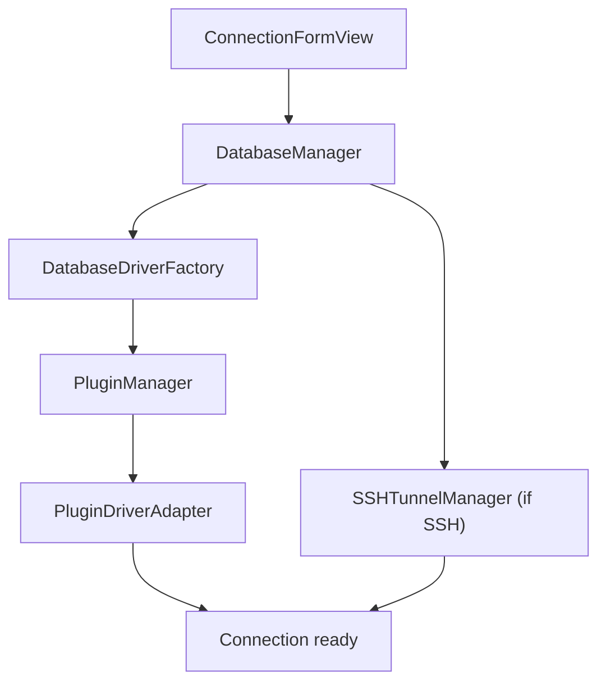

import DriverCounts from "/snippets/driver-counts.mdx";

Every database driver is a bundle the app loads at runtime. That decision shapes the rest: nothing switches on database type, no driver list is compiled in, and `DatabaseType` is a string-based struct rather than an enum, so a type from a plugin the app has never heard of still round-trips through Codable.

The UI is SwiftUI with AppKit underneath it for windows, menus, and the data grid. Async work is Swift concurrency throughout. Database connectivity is native C libraries, linked as static `.a` files out of `Libs/`.

[`CLAUDE.md`](https://github.com/TableProApp/TablePro/blob/main/CLAUDE.md) in the repository root is the authority on the rules a change has to satisfy: the invariants that have caused real bugs, the ABI policy, and what has to happen before a commit lands. This page is the map of where things live, not the rulebook.

## Plugin system

`PluginManager` (`Core/Plugins/`) discovers bundles, version-checks them, and loads them. Four pieces carry the whole system:

| Component | Location | Role |
|-----------|----------|------|
| TableProPluginKit | `Plugins/TableProPluginKit/` | Shared framework: the `TableProPlugin`, `DriverPlugin`, and `PluginDatabaseDriver` protocols plus the transfer types |
| PluginManager | `Core/Plugins/PluginManager.swift` | Discovers, validates, and loads plugin bundles |
| PluginDriverAdapter | `Core/Plugins/PluginDriverAdapter.swift` | Bridges `PluginDatabaseDriver` to the app's internal `DatabaseDriver` |
| DatabaseDriverFactory | `Core/Database/DatabaseDriver.swift` | Resolves a `DatabaseType` to a loaded plugin |

`Packages/TableProCore/Sources/TableProPluginKit` is a symlink to the same files, so edit only the copy under `Plugins/TableProPluginKit/`.

<DriverCounts />

A driver is one of four roles a bundle can take. `ExportFormatPlugin`, `ImportFormatPlugin`, and `DocumentInspectorPlugin` are the others, which is how the CSV, JSON, SQL, XLSX, and MQL formats and the CSV inspector ship.

### Opt-in protocols

A driver adopts these on top of `PluginDatabaseDriver` to reach extra surfaces. The app finds them with a runtime cast, so skipping one costs nothing and no ABI bump is involved.

| Protocol | What adopting it gets you |
|----------|---------------------------|
| `PluginDiagnosticProvider` | A driver-written explanation in front of a raw connection error |
| `PluginProcedureFunctionSupport` | Stored procedures and functions in the structure tab |
| `PluginDefaultSortProvider` | Per-table control of default sorting: `.useAppDefault`, `.suppress`, or `.forceColumns([String])` |
| `PluginPrincipalManagement` | Users, roles, and grants in the Users & Roles tab |
| `PluginBrowseFilterProvider` | Control of the sidebar object filter: glob syntax, case sensitivity, type scopes |
| `SettablePlugin` | A settings pane of your own under **Settings > Plugins** |

### PluginKit ABI

TableProPluginKit builds with `BUILD_LIBRARY_FOR_DISTRIBUTION = YES`, so its public ABI is resilient: the Swift runtime fills any requirement an already-built plugin never implemented from the protocol's default, and that plugin keeps loading under a newer app. Adding a requirement with a default is free. Removing one, or adding a parameter to an existing public initializer, breaks every shipped binary.

Run `scripts/check-pluginkit-abi.sh` before merging anything under `Plugins/TableProPluginKit/`. [Plugin Development](/development/plugin-development#abi-compatibility) has the additive-versus-breaking rules and what a breaking change obliges you to do.

## Key services

`DatabaseManager` (`Core/Database/DatabaseManager.swift`) is the connection pool and the interface every view and coordinator goes through for connect, disconnect, reconnect, and session tracking. `ConnectionHealthMonitor` pings each live connection every 30 seconds and reconnects with exponential backoff.

`MainContentCoordinator` is the central coordinator, one per connection session rather than per window, built by `SessionStateFactory` and split across extension files in `Views/Main/Extensions/` (`+Alerts`, `+Filtering`, `+Pagination`, and the rest). New coordinator behavior goes in a new extension file rather than the main one.

Autocomplete is three pieces. `CompletionEngine` ranks the suggestions and knows nothing about the editor framework; `QueryCompletionAdapter` bridges it to CodeEdit. `SQLContextAnalyzer` reads what the cursor sits in: a table reference, a column reference, a keyword. `SQLSchemaProvider` is an actor that caches schema and hands concurrent callers the same in-flight `Task` rather than firing a second `fetchTables()`.

## Change tracking

<Steps>
  <Step title="Edit">
    `DataChangeManager` records the cell edit as a pending change. Nothing has reached the server.
  </Step>
  <Step title="Save">
    `SQLStatementGenerator` turns the pending set into INSERT, UPDATE, and DELETE statements.
  </Step>
  <Step title="Undo">
    Grid edits register on the window's `UndoManager`, which `TabWindowController.windowWillReturnUndoManager` resolves to the selected `ConnectionWorkspace.undoManager`. One window hosts several connections, so the undo stack is per connection, not per window. Structure edits use a private `UndoManager` inside `StructureChangeManager`.
  </Step>
</Steps>

`AnyChangeManager` wraps whichever concrete manager is active behind the `ChangeManaging` protocol, so callers do not care which one they have.

## MCP server

`Core/MCP/` holds a Model Context Protocol server bound to loopback, speaking plain HTTP through `NWListener`. Nothing in it is reachable off the machine: no TLS, no remote mode. `MCPProtocolDispatcher` is an actor that resolves the protocol era from the request, checks scopes, runs each handler in its own task under a 330-second deadline, and normalizes the result envelope. `MCPServerManager` owns the lifecycle on the main actor: port binding, the bridge credential, the handshake file.

The wire contract, the tool catalog, and the version policy are documented for consumers: [MCP Protocol](/external-api/mcp-protocol), [MCP Tools](/external-api/mcp-tools), [Versioning](/external-api/versioning).

## Connecting

A cancelled connect is the hard case here, because `Task.cancel()` cannot interrupt a driver blocked in a C call. `CLAUDE.md` sets out what a driver owes the app on that path, written down after the same bug shipped four times.

## State and storage

| Pattern | What it holds | Where |
|---------|---------------|-------|
| `@Observable` | UI state, sessions, active tab | ViewModels |
| Keychain | Connection passwords | `ConnectionStorage` |
| UserDefaults | Preferences, filter defaults, favorites, recents | `Core/Storage`, via `AppSettingsStorage` |
| SQLite FTS5 | Query history, full-text searchable | `QueryHistoryStorage` |
| JSON files | Tab state, per-table filters | `TabPersistenceCoordinator`, `TabDiskActor` |

`CLAUDE.md` carries the full storage table, including which stores sync through iCloud and which stay device-local.

## Dependencies

| Package | Source | Purpose |
|---------|--------|---------|
| CodeEditSourceEditor | Vendored in `LocalPackages/`, with CodeEditTextView and CodeEditLanguages | Tree-sitter code editor |
| TableProCore | Local package in `Packages/` | SwiftPM modules the macOS and iOS apps share |
| TableProOracle | Local package in `Packages/`, wraps a pinned TablePro fork of OracleNIO | Oracle wire protocol for OracleDriverPlugin |
| Sparkle | SPM, 2.9.5+ | Auto-update with EdDSA signing |
| swift-certificates | SPM, 1.19.0+ | X.509 types, linked by the app target |
| Yams | SPM, 5.1.0+ | YAML parsing for project folder import |

`Plugins/DamengDriverPlugin` links a Rust wire-protocol bridge built from `Native/DamengBridge`, not an SPM package.

For the repository layout, see [Project Structure](/development/setup#project-structure).
