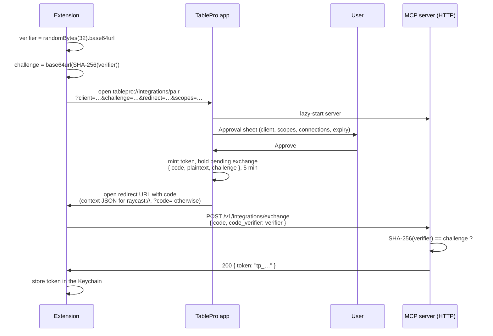

Four steps: generate a verifier, open a deep link, catch the one-time code, trade it for a token over
localhost. TablePro releases the token only to the caller that can produce the verifier, so an app
that intercepts the redirect holds a code it cannot spend.

Nothing about this is Raycast-specific. Any client that can receive a callback, through its own URL
scheme or a loopback HTTP listener, can pair.

## Sequence



<Frame caption="The pairing approval sheet">
  
  
</Frame>

## The whole client, in one file

```ts
import { randomBytes, createHash } from "node:crypto";
import { readFile } from "node:fs/promises";
import { homedir } from "node:os";

const b64url = (b: Buffer) =>
  b.toString("base64").replace(/\+/g, "-").replace(/\//g, "_").replace(/=+$/, "");

// Step 1. Keep the verifier in memory until the exchange. Never log it.
const verifier = b64url(randomBytes(32));
const challenge = b64url(createHash("sha256").update(verifier).digest());

// Step 2. Open the deep link. The parameters are on the URL scheme page.
const params = new URLSearchParams({
  client: "My Editor on macbook-pro",
  challenge,
  redirect: "http://127.0.0.1:7391/callback",
  scopes: "readWrite",
});
await openUrl(`tablepro://integrations/pair?${params}`); // however your host opens a URL

// Step 3. Your callback receives ?code=<uuid>, or ?error=denied when the user says no.
export async function exchange(code: string): Promise<string> {
  const handshakePath = `${homedir()}/Library/Application Support/TablePro/mcp-handshake.json`;
  const { port } = JSON.parse(await readFile(handshakePath, "utf8"));

  const res = await fetch(`http://127.0.0.1:${port}/v1/integrations/exchange`, {
    method: "POST",
    headers: { "Content-Type": "application/json" },
    body: JSON.stringify({ code, code_verifier: verifier }),
  });
  if (!res.ok) throw new Error(`pairing failed: ${res.status}`);

  const { token } = await res.json();
  return token; // Step 4. Straight into the Keychain, never a plain file.
}
```

Three constraints decide whether TablePro accepts the request at all:

- The **verifier** is 43 to 128 characters from `A-Z a-z 0-9 - . _ ~`. 32 random bytes in base64url
  is 43.
- The **challenge** is its base64url SHA-256, so exactly 43 base64url characters.
- The **redirect** is a loopback `http` or `https` URL (`127.0.0.1`, `localhost`, `::1`), or a
  private-use scheme an installed app has registered. Anything else, or one carrying credentials, is
  refused with *"The redirect address is not a local callback, so pairing was refused."*

One delivery detail: a `raycast://` redirect gets the code wrapped as `?context={"code":"<uuid>"}`,
Raycast's launch-context convention, and every other scheme gets a flat `?code=<uuid>`.

The exchange endpoint takes no bearer token: the single-use code plus the verifier is the credential.
It and `/mcp` are the only paths the server serves, and both accept `POST` only.

## What the user approves

The sheet names the client and counts down the five minutes the request is good for, dimming
**Approve** when it runs out. Three controls sit under that: **Permission Level** (starting at what
the link asked for, movable in either direction), **Allowed Connections** (all, or a checked subset),
and **Expiration** (never, 1, 7, 30 or 90 days). The link's parameters are a request, not a grant.

Approving mints the token, holds the plaintext against a one-time code for 5 minutes, and opens the
redirect. Pairing again mints a second token rather than replacing the first, so an extension that
re-pairs should stop using its old one. Revoke either under
**Settings > Integrations > Authentication**.

## Security properties

| Property | How |
|----------|-----|
| The token is never in a URL | It travels over localhost HTTP; the deep link carries only a code. |
| Intercepting the redirect is useless | The code cannot be exchanged without the verifier. |
| A code is single-use | Success, a failed verification, or 5 minutes deletes it. |
| The plaintext token is not persisted | Only a salted SHA-256 hash is saved, in the login keychain. |

## Errors

A failed verification burns the code, so retrying with a guessed verifier is not an option: start a
new pair request.

| Code | Meaning |
|------|---------|
| `400` | Malformed body, a missing `code` or `code_verifier`, a field over 1,024 bytes, or a verifier that is not 43 to 128 unreserved characters. |
| `403 Challenge mismatch` | The verifier does not hash to the stored challenge. |
| `404 Pairing code not found` | The code never existed, or was already exchanged. |
| `410 Pairing code expired` | The pending exchange is older than 5 minutes. |
| `429 Too Many Requests` | Five failed exchanges from this address within 5 minutes. Locked out for 15, with `Retry-After` on the response. |

Every failed exchange lands in the activity log under the `auth` category with outcome `denied`.

Clicking **Deny** opens the redirect with `error=denied` and `error_description=user_denied`, wrapped
in the `context` JSON for `raycast://` and appended as flat parameters otherwise.
